# Azure DevOps - Pipeline
1. Заходим в Azure с помощью своего университетского аккаунта. Проверяем доступность ресурсов.
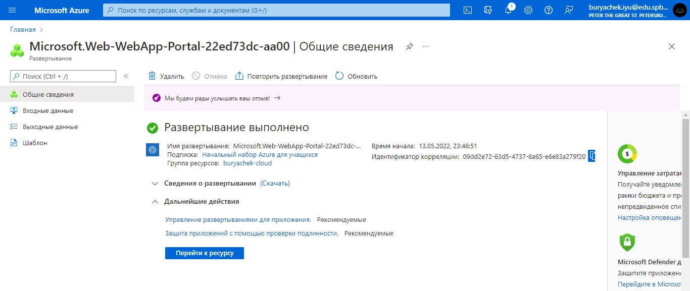

2. Содаем новы ресурс.
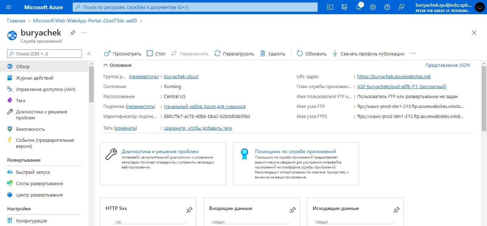

3. Устанавливаем pytest, настраиваем Pycharm для запуска тестов через IDE.
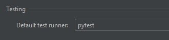

4. Запуск тестов.
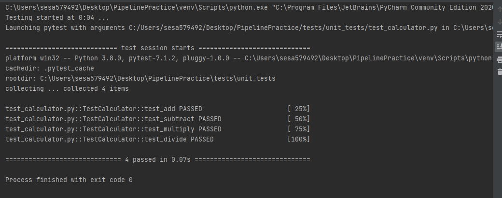

5. В классе Calculator допускаем ошибку в функции. Пишем, что 4+7 = 12.
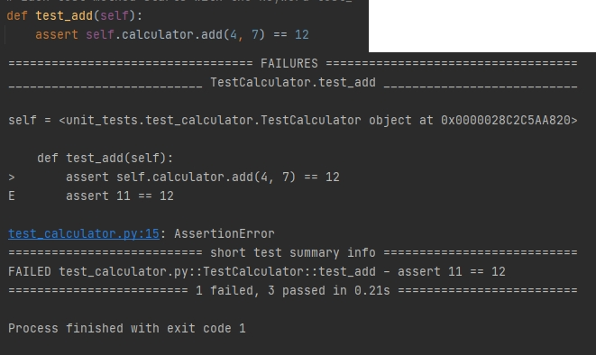

6. Устанавливаме модуль selenium.
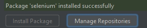

7. Скачиваем необходимый драйвер (chrome) и вкладываем в папку с функциональными тестами.
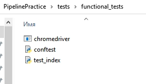

8. Запускаем веб-приложение.
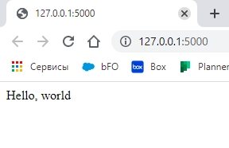

9. Запускаем тесты.Проверяем, чтобы все были пройдены.
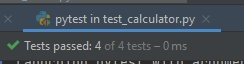

10. Открываме проект.
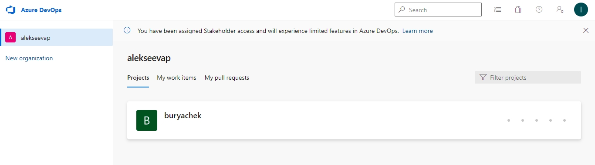

11. Создаём CI pipeline, выбираем Git как источник кода, выбираем репозитори PipelinePractice, в yaml файл вставляем нужны код.
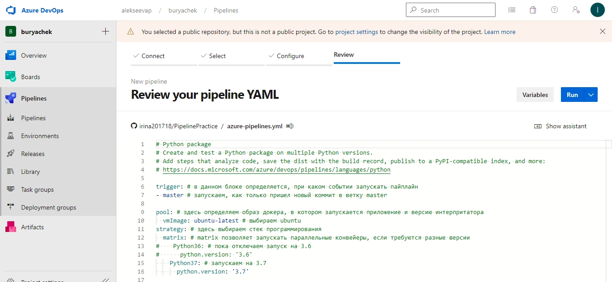

12. Нажимаем Run. Переходим в пайплайн. Убеждаемся, что все stages выполнены
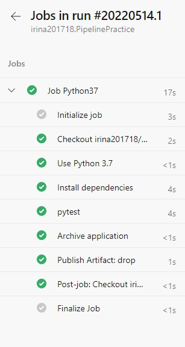

13. Смотрим артефакты.
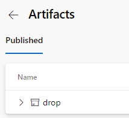

14. В Azure DevOps создаем Release
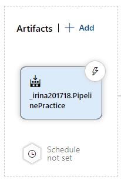

15. В артефакт добавляем результат pipeline из CI конвейра, ставим триггер. 
16. Добавляем Stage. Stage называем deploy.
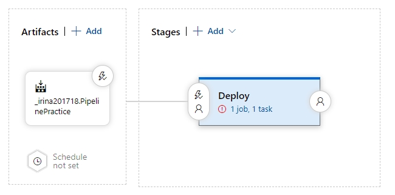

17. Удаляем все stages. Добавляем Azure App Service Deploy.
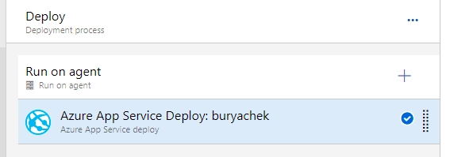

18. Конфигурируем настройки сервиса в Azure.
19. Нажимаем Create release. 
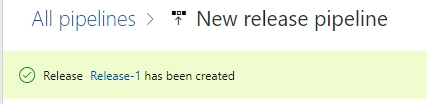

